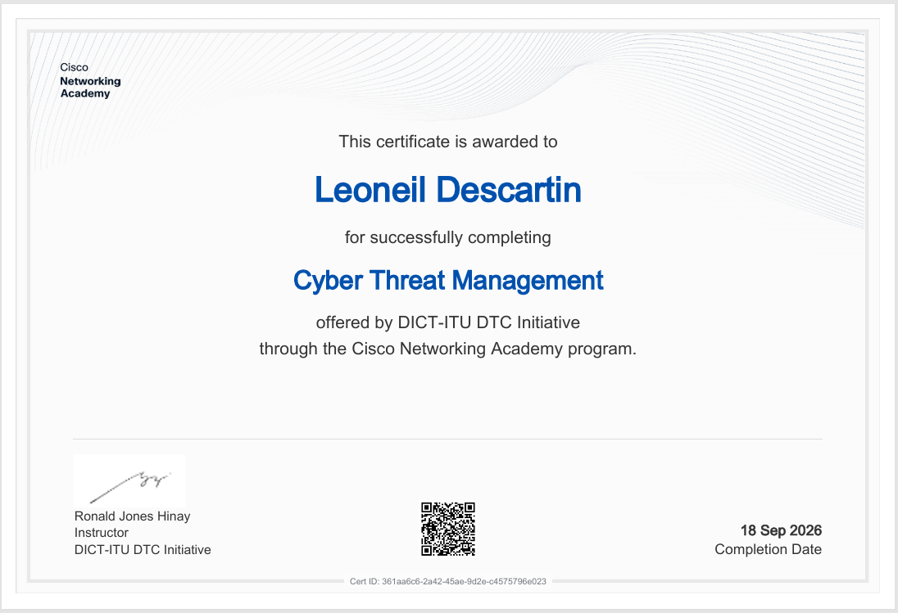

# 🎓 Certifications

## Introduction to Cybersecurity
### Cisco Networking Academy
*Issued: July 2026 · Cert ID: 549b6111-760a-4490-874a-6be9656724aa*

**Skills covered:**
- Online safety fundamentals and the impact of cybersecurity
- Common cyber threats, attacks, and vulnerabilities
- Personal protection strategies while online
- How organizations protect their operations against attacks
- Cybersecurity career pathways and opportunities

---

## Operating Systems Basics
### Cisco Networking Academy
*Issued: Aug 23, 2026*

**Skills covered:**
- Explain the architecture of Windows and its operation
- Use Windows administrative tools to configure, monitor, and manage system resources
- Use the Linux shell to manipulate text files, identify services running, and locate/monitor log files
- Implement basic Linux security
- Explain how to configure network connectivity and email on mobile devices
- Explain the purpose and characteristics of mobile operating systems

---

## Cyber Threat Management
### DICT-ITU DTC Initiative · Cisco Networking Academy
*Issued: Sept 18, 2026 · Cert ID: 361aa6c6-2a42-45ae-9d2e-c4575796e023*

**Skills covered:**
- Explain why organizations must conform with specific compliance frameworks according to institutional context
- Evaluate network and systems vulnerability
- Create a vulnerability assessment plan by identifying and describing relevant threats
- Explain how IT systems vulnerability is assessed
- Select security controls based on organizational relevance and create a risk management plan
- Explain how organizations recover from cybersecurity exploits
- Recommend disaster recovery and incident response activities for a given organizational context
- Explain how forensic investigations of internal and external security incidents are performed

---
---

*More certifications will be added here as I progress through my SOC Analyst roadmap.*
