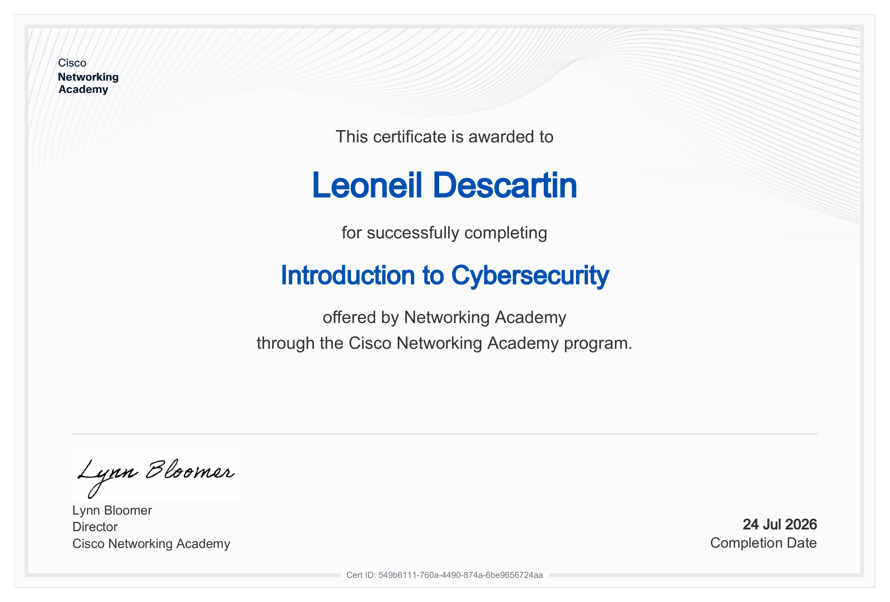

# 🎓 Certifications

## Introduction to Cybersecurity
### Cisco Networking Academy

*Issued: July 2026 · Cert ID: 549b6111-760a-4490-874a-6be9656724aa*

**Skills covered:**
- Online safety fundamentals and the impact of cybersecurity
- Common cyber threats, attacks, and vulnerabilities
- Personal protection strategies while online
- How organizations protect their operations against attacks
- Cybersecurity career pathways and opportunities

---

*More certifications will be added here as I progress through my SOC Analyst roadmap.*
